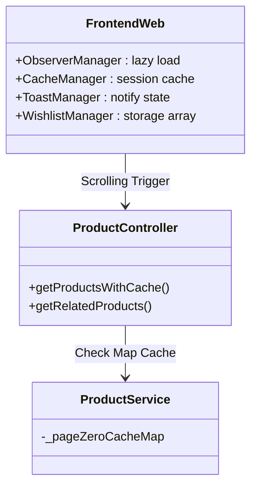

## Context

Dự án hiện tại đã có bộ backend SparkJava và giao diện grid layout. Bổ sung các tính năng nâng cao thương mại điện tử chuyên sâu (Wishlist, Caching, Lazy Loading, Image Zoom, Gallery) nhằm đáp ứng nhu cầu tối ưu trải nghiệm và hiệu năng hệ thống lên cấp độ cao nhất.

## Goals / Non-Goals

**Goals:**
- Nâng cấp API List Product sang pagination lazy loading với In-memory Cache bên backend cho page 0.
- Tái cấu trúc UX/UI Javascript Client với IntersectionObserver (Infinite scroll), CSS Skeletion Loading, CSS Zoom, CSS Toast Notifications.
- Lưu trữ chức năng Wishlist siêu tốc thông qua LocalStorage.
- Tạo API cho Related Products để Upsale ở Modal.

**Non-Goals:**
- Cấu hình Login Authentication (Vẫn giữ Zero User Backend).
- Wishlist đồng bộ Database thật vì không có user. Giải pháp dùng Trình Duyệt.

## Decisions

### Decision 1: Quản lý Hiệu Năng và Phân Trang
**Chọn:** Bỏ pagination dạng Nút, chuyển sang IntersectionObserver cuộn chuột. Java backend cache ngay cấp độ ConcurrentMap ở tầng ProductService theo param. Frontend lưu Cache Data Array chống fetch lại từ khóa.
**Lý do:** Đây là chuẩn kiến trúc tải trang cực đỉnh hiện đại của mạng xã hội, mượt mà hoàn toàn không render lại giao diện chết. 

### Decision 2: Hệ thống Wishlist Local
**Chọn:** Array ID lưu ở LocalStorage, sync Data vào Icon tim (đỏ/rỗng) qua State manager Mini.
**Lý do:** Tuân thủ Strict Code của việc cấm xây dựng Auth backend. Cực nhanh độ trễ 0ms.

## Architecture

