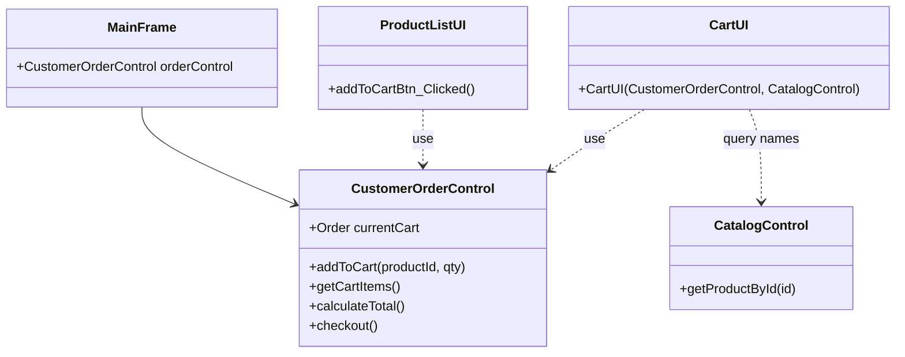

## Class Diagram

```mermaid
classDiagram
  class MainFrame {
     +CustomerOrderControl orderControl
  }
  class CustomerOrderControl {
     +Order currentCart
     +addToCart(productId, qty)
     +getCartItems()
     +calculateTotal()
     +checkout()
  }
  class CatalogControl {
     +getProductById(id)
  }
  class CartUI {
     +CartUI(CustomerOrderControl, CatalogControl)
  }
  class ProductListUI {
     +addToCartBtn_Clicked()
  }

  MainFrame --> CustomerOrderControl
  ProductListUI ..> CustomerOrderControl : use
  CartUI ..> CustomerOrderControl : use
  CartUI ..> CatalogControl : query names
```
