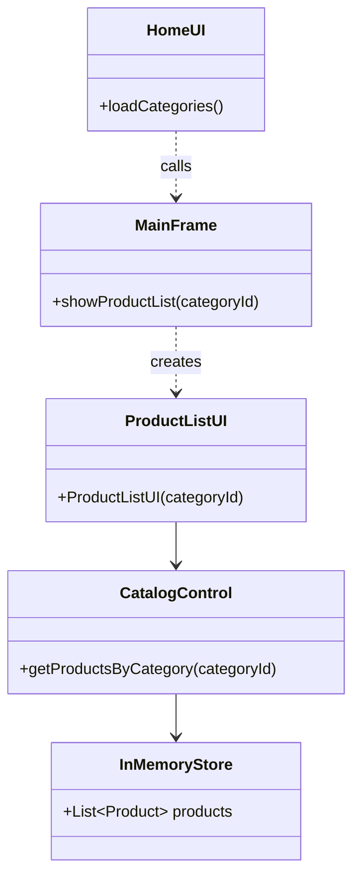
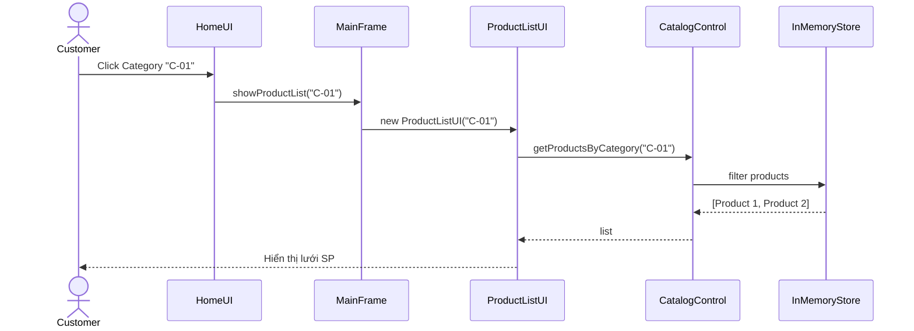

## 1. Class Diagram Updates

```mermaid
classDiagram
  class HomeUI {
     +loadCategories()
  }
  class ProductListUI {
     +ProductListUI(categoryId)
  }
  class MainFrame {
     +showProductList(categoryId)
  }
  class CatalogControl {
     +getProductsByCategory(categoryId)
  }
  class InMemoryStore {
     +List~Product~ products
  }
  
  HomeUI ..> MainFrame : calls
  MainFrame ..> ProductListUI : creates
  ProductListUI --> CatalogControl
  CatalogControl --> InMemoryStore
```

## 2. Sequence Diagram (Happy Path)

```mermaid
sequenceDiagram
  actor Customer
  participant HUI as HomeUI
  participant MF as MainFrame
  participant PUI as ProductListUI
  participant Ctrl as CatalogControl
  participant DB as InMemoryStore
  
  Customer->>HUI: Click Category "C-01"
  HUI->>MF: showProductList("C-01")
  MF->>PUI: new ProductListUI("C-01")
  PUI->>Ctrl: getProductsByCategory("C-01")
  Ctrl->>DB: filter products
  DB-->>Ctrl: [Product 1, Product 2]
  Ctrl-->>PUI: list
  PUI-->>Customer: Hiển thị lưới SP
```
