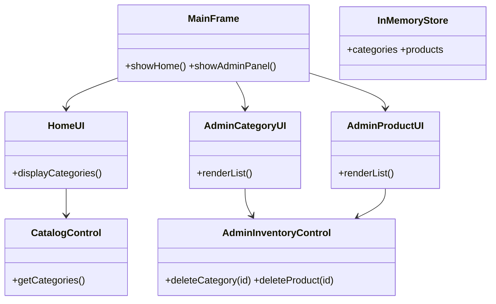
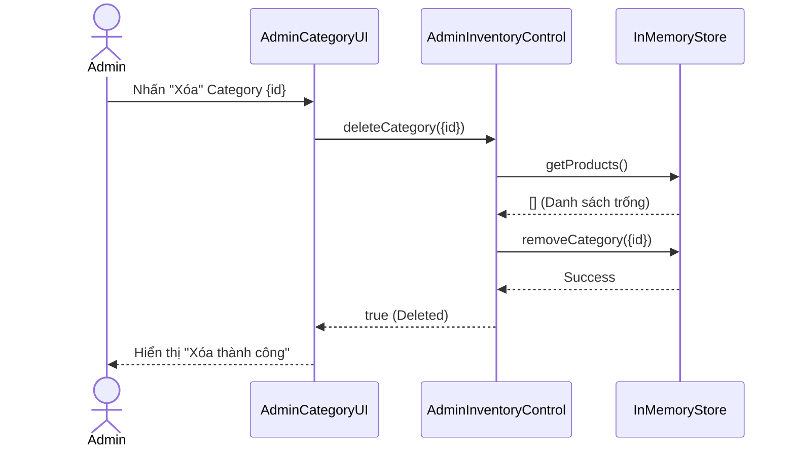

## Context
Dự án desktop sử dụng kiến trúc BCE kết nối In-Memory DB. Bỏ qua hoàn toàn việc xác thực/đăng nhập.

## Goals / Non-Goals
**Goals:** Dựng Class diagram cho BCE tập trung vào Home và Admin. Mô hình lưu trữ In-Memory DB.
**Non-Goals:** KHÔNG làm Đăng nhập/Đăng ký. KHÔNG làm Checkout.

## Decisions

### 1. Data Model
```java
class Category { String id; String name; String iconPath; }
class Product { String id; String categoryId; String name; double price; int stock; }
class OrderLineItem { String productId; int quantity; }
class Order { String id; List<OrderLineItem> items; }
```

### 2. Kiến Trúc Class Diagram (BCE)


### 3. Cấu Trúc Package
```text
src/
 ├── main/java/stationary/
 │    ├── boundary/                 
 │    │    ├── core/MainFrame.java          
 │    │    ├── customer/HomeUI.java             
 │    │    └── admin/AdminPanel.java              
 │    ├── control/                  
 │    ├── entity/                   
 │    └── store/InMemoryStore.java                 
 └── test/
```

### 4. Sequence Diagram (Happy Path: Admin Xóa Category)

