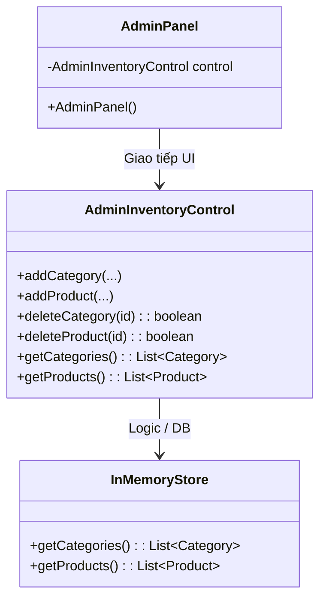
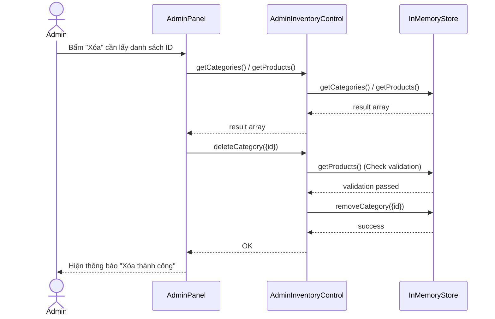

## Context

Hiện tại, lớp `AdminPanel` (thuộc Boundary layer) đang gọi trực tiếp vào lớp `InMemoryStore` để lấy danh sách danh mục và sản phẩm (`getCategories()`, `getProducts()`). Việc này vi phạm quy tắc cơ bản của cấu trúc BCE: Boundary không được liên kết thẳng với Entity hay Database mà phải thông qua Control. Mảnh tech debt này đến từ việc thiếu các method `get` trong `AdminInventoryControl`, khiến UI developer đành "chọc" thẳng vào data. Việc này cần được làm sạch để các luồng sau này bám sát chuẩn kiến trúc.

## Goals / Non-Goals

**Goals:**
- Tuân thủ nghiêm ngặt nguyên tắc BCE: mọi lệnh thao tác lên Entity hoặc Store từ UI đều phải chạy quan `AdminInventoryControl`.
- Đảm bảo tính đóng gói cho Store; không để Store bị thao tác thả cửa ở tầng giao diện màn hình.

**Non-Goals:**
- Không sửa luồng của Customer (HomeUI vốn dĩ đang đúng chuẩn).
- Không thêm tính năng thực như Cart, Order hay thay đổi định nghĩa class `Product`, `Category`.

## Decisions

Chúng ta sẽ cung cấp 2 public method mới cho lớp `AdminInventoryControl`:
1. `public List<Category> getCategories()`
2. `public List<Product> getProducts()`

Hai hàm này đóng vai trò Wrapper để bọc các hàm tương ứng của `InMemoryStore`, giúp `AdminPanel` có thể triệu gọi danh sách một cách an toàn. Thay vì gọi `InMemoryStore.getInstance().getCategories()`, `AdminPanel` sẽ gọi `control.getCategories()`.

### 1. Data Model
*(Được giữ nguyên)*
- `Category(id, name, iconPath)`
- `Product(id, categoryId, name, price, stock)`

### 2. Cấu Trúc Package (Project Structure)
*(Được giữ nguyên - tham chiếu các gói có sẵn)*
```text
src/
 ├── main/java/stationary/
 │    ├── boundary/                 
 │    │    └── admin/AdminPanel.java          
 │    ├── control/                  
 │    │    └── AdminInventoryControl.java
 │    ├── entity/                   
 │    └── store/InMemoryStore.java                 
```

### 3. Sơ đồ Lớp (Class Diagram) sau khi Refactor



### 4. Sơ đồ Tuần tự (Sequence Diagram) - Happy Path: Bấm Xóa / Lấy List



## Risks / Trade-offs

- [Risk] Boundary đang lặp lại code ở chỗ nào khác không? → Mitigation: Chỉ có AdminPanel và HomeUI, ta đã check HomeUI và nó tuân thủ tốt. Chỉ có AdminPanel dính tech debt này.
- [Risk] Test failures nếu các mock/setup liên quan có sự phụ thuộc vào code cũ? → Mitigation: Chạy lại các tests (BDD Cucumber suite) để cover 100%. Mọi cucumber steps đang mock/gọi qua Control cũng sẽ được an toàn.
