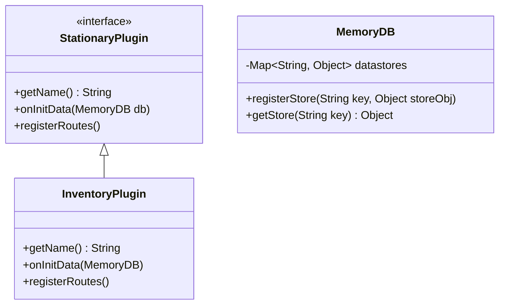
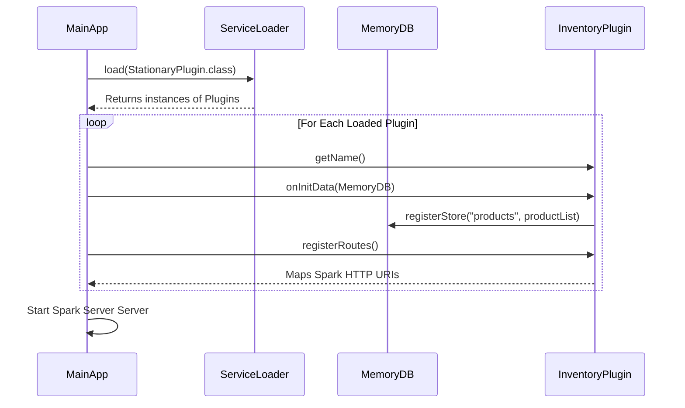

## Context

Hệ thống Stationary hiện tại được phát triển ở chuẩn ứng dụng đơn khối (Monolith) nhằm đáp ứng nhanh pha đầu. Việc tiếp tục dồn các chức năng lớn (Giỏ hàng, Đơn hàng, Xác thực Mock, Phân quyền) chung vào một project duy nhất sẽ gây tắc nghẽn cục bộ (conflict code), khó bảo trì, và làm mờ ranh giới chuẩn Strict BCE. Vì vậy, ta cần tái thiết kế thành cấu trúc Microkernel: một `stationary-core` và nhiều Plugin-slots riêng rời.

## Goals / Non-Goals

**Goals:**
- Tạo cấu trúc Multi-module Maven (Một `pom.xml` cha và các `pom.xml` con).
- Xây dựng hạ tầng cho `stationary-core`: Bộ khởi động SparkServer, `PluginManager`, `MemoryDB` Container chung, thư viện SPI `StationaryPlugin`.
- Tái sử dụng source Admin Inventory đưa vào module độc lập `plugin-inventory`.
- Đảm bảo khởi động tự động bằng chuẩn `java.util.ServiceLoader`.

**Non-Goals:**
- Không thay đổi nghiệp vụ của quy trình Inventory bấy lâu.
- Dùng giải pháp phức tạp nhúng runtime (OSGi/PF4J). ServiceLoader là đã đủ cho classpath loading.

## Structual Design & Project Package

Cấu trúc cây thư mục hệ thống sẽ thay đổi:
```text
stationary (Root Maven)
├── pom.xml
├── stationary-core/ (Bo mạch chính)
│   ├── src/main/java/stationary/core/
│   │   ├── app/MainApp.java (Boot)
│   │   ├── spi/StationaryPlugin.java (Cái Khe Cắm)
│   │   ├── db/MemoryDB.java (Share Component Lookup)
│   │   └── web/RouteRegistry.java
├── plugin-inventory/ (Khe Cắm)
│   ├── src/main/resources/META-INF/services/stationary.core.spi.StationaryPlugin
│   └── src/main/java/stationary/inventory/
│       └── InventoryPlugin.java (implements StationaryPlugin)
├── plugin-cart/
├── plugin-order/
├── plugin-notify/
└── plugin-user/
```

## Component Relational Diagram

```mermaid
graph TD
    A[Spark Web Server] -->|Host| B(stationary-core)
    B -->|Provides SPI| C1(StationaryPlugin Interface)
    B -->|Provides DB| C2(MemoryDB Share)
    
    C1 <.. D[plugin-inventory]
    C1 <.. E[plugin-cart]
    
    D -->|Register Routes| A
    E -->|Register Routes| A
    
    D -->|Init Category/Product| C2
```

## Class Diagram & Core Data Model

Data Model InMemory trên hệ thống Microkernel chỉ đóng vai trò Box chứa đối tượng (Registry). Các plugin tự do đẩy cấu trúc dữ liệu mảng con vào Box để plugin khác móc nối đọc ra nếu có quyền.



## Sequence Diagram (Bootstrapping Happy Path)

Trình tự hoạt động khi `stationary-core` lên sóng:


## Decisions

- **Chuẩn SPI `java.util.ServiceLoader`**: Quyết định chọn giải pháp sẵn có siêu nhẹ của JRE thay vì một Dependency framework 3rd party nhằm đảm bảo dự án giữ vững tiêu chí "Core business mức đơn giản".
- **`MemoryDB` pattern Locator**: Giữ mọi thứ lưu trên RAM như config nhưng tại root core. Đóng vai trò Locator (tra cứu). Map `Key -> Value` dùng truyền dữ liệu tĩnh giữa Cart, Product an toàn mà không phải depend Class với nhau quá dày.

## Risks / Trade-offs

- [Risk] Cấu trúc test BDD Cucumber sẽ gặp gián đoạn tạm thời khi bị phân bổ làm nhiều thư mục.
  - Mitigation: Điều chỉnh Scope cấu hình của `maven-surefire-plugin` ở file root cha, cho quét toàn bộ `test` resources ở các Module con thay vì tập trung một dòng lệnh.
